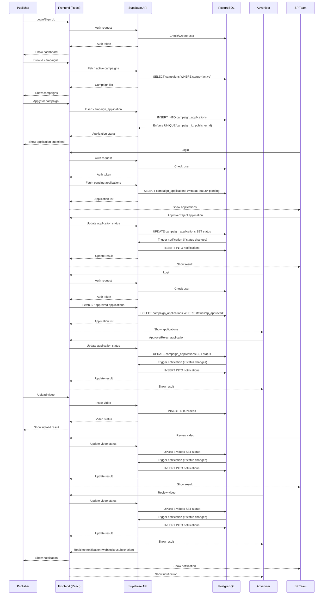

# Endorse-Flow-Nexus Service Flow

This document describes the full, detailed service flow for the Endorse-Flow-Nexus platform, covering all major user roles and system interactions.

---

## Sequence Diagram

---

## Step-by-Step Service Flow

### 1. **User Authentication**
- All users (Publisher, SP Team, Advertiser) sign up or log in via the frontend.
- The frontend sends authentication requests to Supabase, which checks/creates users in the database and returns an auth token.

### 2. **Publisher Campaign Application**
- Publisher browses active campaigns (fetched from Supabase/PostgreSQL).
- Publisher applies for a campaign; the frontend sends an insert request to Supabase.
- Supabase enforces a unique constraint (one application per publisher per campaign).
- Publisher receives application status feedback.

### 3. **SP Team Application Review**
- SP Team logs in and fetches pending applications.
- SP Team approves or rejects applications via the frontend.
- The frontend updates the application status in Supabase/PostgreSQL.
- If the status changes, a notification is triggered and inserted into the notifications table.
- SP Team receives feedback on the result.

### 4. **Advertiser Application Review**
- Advertiser logs in and fetches SP-approved applications.
- Advertiser approves or rejects applications via the frontend.
- The frontend updates the application status in Supabase/PostgreSQL.
- If the status changes, a notification is triggered and inserted into the notifications table.
- Advertiser receives feedback on the result.

### 5. **Publisher Video Upload**
- After approval, the publisher uploads a video for the campaign.
- The frontend sends the video data to Supabase/PostgreSQL.
- Publisher receives upload status feedback.

### 6. **SP Team and Advertiser Video Review**
- SP Team and Advertiser review video submissions.
- They approve or reject videos via the frontend.
- The frontend updates the video status in Supabase/PostgreSQL.
- If the status changes, a notification is triggered and inserted into the notifications table.
- Reviewers receive feedback on the result.

### 7. **Notifications**
- Supabase sends real-time notifications to the frontend via websockets/subscriptions.
- All users see notifications for relevant events (application/video approval or rejection).

---

This flow ensures a clear, auditable, and user-friendly endorsement workflow for all roles in the Endorse-Flow-Nexus platform. 